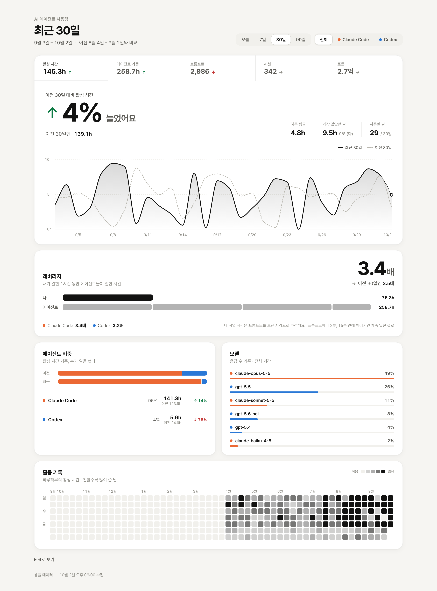
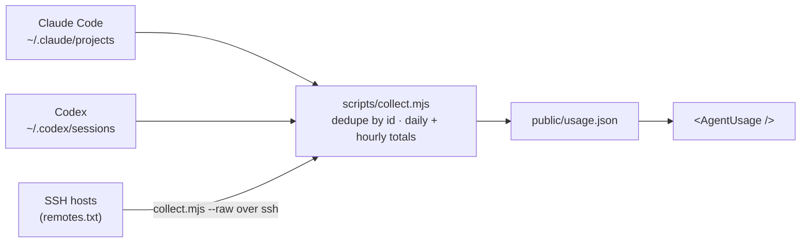

<div align="center">

# agent-leverage

**Your hour, multiplied.**

How many hours do your AI coding agents work for every hour you do, and how does that compare with your past self?
A React dashboard for Claude Code and Codex, built from the logs already on your machine.

[](https://chaehy5665.github.io/agent-leverage/)
[](LICENSE)


[Live demo](https://chaehy5665.github.io/agent-leverage/) · [Quick start](#quick-start) · [Metrics](#metrics) · [Privacy](#privacy)

</div>

<br>

<picture>
  <source media="(prefers-color-scheme: dark)" srcset="docs/screenshot-dark.png">
  
</picture>

<p align="center"><sub>Screenshots and the live demo use synthetic sample data. The UI copy is in Korean.</sub></p>

## Highlights

- **Leverage.** Agent hours ÷ your hours: how many hours your agents worked for every hour you did, per agent, now vs. before.
- **Today vs. yesterday at this time.** A day in progress isn't compared with all of yesterday. It's compared with yesterday *up to the same clock time*, using hourly data.
- **Overlap-aware time.** Parallel sessions, subagents, and two agents running at once are counted once for wall-clock time.
- **Every machine, once.** Logs from SSH servers are merged with local ones, and sessions the desktop app mirrors locally aren't double-counted.
- **Private by default.** Only daily and hourly totals leave the collector. No prompt text, file paths, or project names.

## Quick start

```bash
npm install
npm run collect   # your logs → public/usage.json (gitignored)
npm run dev
```

Without `public/usage.json`, the app renders the synthetic sample (`public/usage.sample.json`).

| URL option | |
|---|---|
| `?sample` | Show sample data even when your own data exists (screenshots, demos) |
| `?theme=light` / `?theme=dark` | Pin the theme instead of following the OS |

## How it works



| Agent | Reads | Counting |
|---|---|---|
| Claude Code | `~/.claude/projects/**/*.jsonl` | Responses de-duplicated by `message.id` and prompts by record `uuid`, so resumed sessions that copy old history count once |
| Codex | `~/.codex/sessions/**/*.jsonl` | Tokens from deltas of the cumulative `token_count`, prompts from `task_started` |

## Metrics

| Metric | Meaning |
|---|---|
| **Active time** | Wall-clock time any agent was working. Overlapping sessions, and agents, count once. Gaps over 5 minutes are idle. |
| **Agent hours** | Sum of every session's working time. Parallel sessions and subagents stack. |
| **Prompts** | Requests you sent yourself |
| **Sessions** | Conversations active on a day |
| **Tokens** | Input + output (cache reads excluded) |
| **Leverage** | Agent hours ÷ your working time |

**Your working time is an estimate.** Logs only record when you sent a prompt, so each prompt counts the 2 minutes before it, for reading results and writing. A next prompt within 15 minutes joins the stretch, and using two agents at once still counts as your one hour. Tune it with `PROMPT_LEAD_MS` and `PROMPT_JOIN_MS` in `scripts/collect.mjs`.

**Pick a range:** today, 7, 30, or 90 days. Each range is compared with the one right before it, and today with yesterday at the same time.

**Each number appears once.** The current value lives in the tab, the change in the hero, and the previous value in the sentence under it. Charts show numbers on hover.

<details>
<summary><b>What's on the page</b></summary>

- **Metric tabs.** Current value and direction (↑↓) for each metric. The selected one drives everything below.
- **Hero.** How much it changed ("↑ 95%"), the previous value, and three supporting stats.
- **Trend.** Daily current (solid) vs. previous (dashed). An unfinished today is dotted. In *today* mode it's a 0–24h cumulative curve, with yesterday drawn to the end of the day and the gap marked at the current time.
- **Leverage.** One bar of your time next to the agents' time drawn as that many copies of it, with per-agent leverage.
- **Agent share.** 100% bars of who did the work, before vs. now.
- **Models.** Top models by number of responses.
- **Activity.** A contribution-style calendar of up to a year, fitted to the width.
- **Table view.** The same numbers as a table (hourly in *today* mode).

Color is used only to identify agents (Claude Code orange, Codex blue). Everything else is one ink ramp. Light and dark themes are supported, and motion turns off under `prefers-reduced-motion`.

</details>

## Privacy

- `usage.json` holds only daily/hourly aggregates and response counts per model: no prompt text, paths, or project names.
- `public/usage.json` and `remotes.txt` are gitignored.
- The [live demo](https://chaehy5665.github.io/agent-leverage/) is built by GitHub Actions from the repo, so it can only see the synthetic sample. The build also drops `usage.json` from its output, as a second guard.
- Nothing is sent anywhere. The collector reads files locally, or on your own SSH hosts.

## Collecting from SSH servers

If you run `claude` or `codex` directly on a server, its logs only live there. List SSH hosts in `remotes.txt` (one per line), or pass `--remote`. The server only needs `node`, with nothing to install.

```bash
echo my-server >> remotes.txt
npm run collect            # or: npm run collect -- --remote my-server
```

The collector pipes itself to the host over SSH and runs in `--raw` mode, so no files are left behind. It returns only message ids, prompt ids, and activity spans, which are merged by id. The desktop app keeps local copies of its SSH sessions (`~/.claude/projects/ssh-*`), and those merge with the server's originals instead of counting twice. Days follow this machine's time zone.

## Using the component

```tsx
import { AgentUsage } from "./src";

<AgentUsage data={usage} defaultRange={30} defaultMetric="activeHours" />
```

| Prop | Default | |
|---|---|---|
| `data` | — | JSON produced by `collect.mjs` |
| `endDate` | collection day | Last day of the current window (`YYYY-MM-DD`) |
| `defaultRange` | `30` | `1 \| 7 \| 30 \| 90`. `1` is today vs. yesterday at this time |
| `defaultMetric` | `"activeHours"` | `activeHours \| agentHours \| prompts \| sessions \| tokens` |

The theme follows `prefers-color-scheme`, or `<html data-theme="light|dark">` when set.

## Adding another agent

In `scripts/collect.mjs`:

1. Write a `scanXxx(src)` that fills `src.msgs` (responses with tokens), `src.prompts` (your prompts), and `src.files` (activity runs per session).
2. Call it from `scanAll()` and add the agent to `AGENTS`.

The component picks it up as is, and colors are assigned in order.

## License

[MIT](LICENSE)
